<div align="center">


# 🗽 NYC Urban Intelligence Platform

### *52.39 million city records transformed into a governed analytics, forecasting, and decision-support platform for New York City*

<p>
  
  
  
  
  
  
  
</p>

<p>
  
  
  
  
  
</p>

<table>
<tr>
<td align="center"><h3>52.39M</h3><sub>core raw records processed</sub></td>
<td align="center"><h3>48.62M</h3><sub>taxi trips represented in Gold</sub></td>
<td align="center"><h3>$1.306B</h3><sub>taxi revenue analysed</sub></td>
<td align="center"><h3>3.60M</h3><sub>311 complaints mapped to Gold</sub></td>
<td align="center"><h3>0.9618</h3><sub>selected model R²</sub></td>
<td align="center"><h3>11 / 11</h3><sub>automated warehouse tests passed</sub></td>
</tr>
</table>

**Full calendar year 2025 · 263 authoritative TLC taxi zones · 8,760 hourly periods · 2,303,880 Gold zone-hours**

</div>

---

<details open>
<summary><h2 style="display:inline">📖 Table of Contents</h2></summary>

- [Project Objective](#-project-objective)
- [Platform at a Glance](#-platform-at-a-glance)
- [Architecture](#️-architecture)
- [Data Sources](#-data-sources)
- [Engineering Principles](#-engineering-principles)
- [Raw → Bronze → Validation → Silver → Quarantine → Gold](#-raw--bronze--validation--silver--quarantine--gold)
- [Data Quality Decisions](#️-data-quality-decisions)
- [Geospatial Mapping](#️-geospatial-mapping)
- [PySpark and Processing Strategy](#-pyspark-and-processing-strategy)
- [Gold Analytical Dataset](#-gold-analytical-dataset)
- [Azure SQL Data Warehouse](#️-azure-sql-data-warehouse)
- [Incremental Loading and Duplicate Prevention](#-incremental-loading-and-duplicate-prevention)
- [ETL Logging and Failure Handling](#-etl-logging-and-failure-handling)
- [Airflow Orchestration](#-airflow-orchestration)
- [Docker Environment](#-docker-environment)
- [SQL Analysis and Performance Optimization](#-sql-analysis-and-performance-optimization)
- [Machine Learning](#-machine-learning)
- [Model Results](#-model-results)
- [Prediction Storage](#-prediction-storage)
- [Power BI](#-power-bi)
- [Reconciliation](#-reconciliation)
- [Automated Testing and Validation](#-automated-testing-and-validation)
- [Major Issues Encountered and Resolved](#️-major-issues-encountered-and-resolved)
- [Major Validated Insights](#-major-validated-insights)
- [Limitations](#️-limitations)
- [Repository Structure](#️-repository-structure)
- [Running and Reproducing the Platform](#️-running-and-reproducing-the-platform)
- [Security and Secrets](#-security-and-secrets)
- [Technology Stack](#️-technology-stack)
- [Implementation Coverage](#-implementation-coverage)
- [Data Source Attribution](#-data-source-attribution)

</details>

---

## 🎯 Project Objective

The **NYC Urban Intelligence Platform** is an end-to-end data engineering, analytics, and machine-learning project designed to transform large, heterogeneous New York City datasets into a **governed, reproducible, quality-controlled analytical platform**.

The system combines:

- NYC Yellow Taxi trip activity;
- NYC 311 Service Requests;
- historical hourly weather;
- official NYC TLC Taxi Zone reference and geographic data.

The objective is not merely to produce a dashboard. The project implements the complete analytical lifecycle:

```text
Source Acquisition
        ↓
Immutable Raw Storage
        ↓
Bronze Standardisation
        ↓
Validation / Profiling / Data Quality
       ↙ ↘
 Silver   Quarantine
        ↓
Business-Ready Gold
        ↓
Azure SQL Dimensional Warehouse
       ↙  ↓  ↘
 SQL   ML  Power BI
        ↓
Stored Forecasts
```

The platform was built to answer operational and analytical questions such as:

> **Where** is taxi demand concentrated across New York City?  
> **When** does demand change by hour, day, and month?  
> Which taxi zones contribute the most **trips and revenue**?  
> How do **311 complaints** and **weather conditions** align with urban activity?  
> Can future taxi demand be predicted at **zone × hour** grain?  
> Can every important dashboard metric be reconciled back to governed warehouse data?

The project uses the **full 2025 calendar year** and converges the principal analytical sources on a common grain of:

```text
NYC local date × hour × authoritative TLC Taxi Zone
```

A central design requirement was **auditability**. Invalid data is not silently deleted, suspicious data is not automatically treated as invalid, source-to-target differences are explicitly reconciled, warehouse loads are repeatable, and final outputs are validated through SQL controls and automated tests.

---

## 📊 Platform at a Glance

| Area | Actual implementation |
|---|---:|
| Data period | Full year **2025** |
| Core raw event/hour records | **52,386,402** |
| Core valid records after hard DQ rules | **52,333,158** |
| Distinct rejected records | **53,244** |
| Exact duplicate source records detected | **1** |
| Authoritative TLC Taxi Zones | **263** |
| Hours in 2025 | **8,760** |
| Gold analytical rows | **2,303,880** |
| Taxi trips represented in Gold | **48,617,295** |
| Taxi revenue represented in Gold | **$1,306,369,662.27** |
| 311 complaints represented in Gold | **3,603,396** |
| Weather observations | **8,760** |
| Forecast test / stored prediction rows | **385,032** |
| Selected ML model | **Random Forest Regressor** |
| Selected model MAE | **4.1399** |
| Selected model RMSE | **12.0792** |
| Selected model R² | **0.961836** |
| Power BI report pages | **6** |
| Reconciliation controls | **24 / 24 PASS** |
| Automated warehouse tests | **11 / 11 PASS** |

> **Important counting note:** `52,386,402` is the total volume of the three core time-series/event sources — Taxi, 311, and Weather. The Taxi Zone lookup and polygon files are reference geography and are not meaningfully added to that event-row KPI.


---

[⬆️ Back to top](#-nyc-urban-intelligence-platform)

# 🏗️ Architecture

The implemented architecture follows a governed medallion-style data flow while keeping **validation, quarantine, reconciliation, logging, testing, and orchestration** as first-class engineering components.

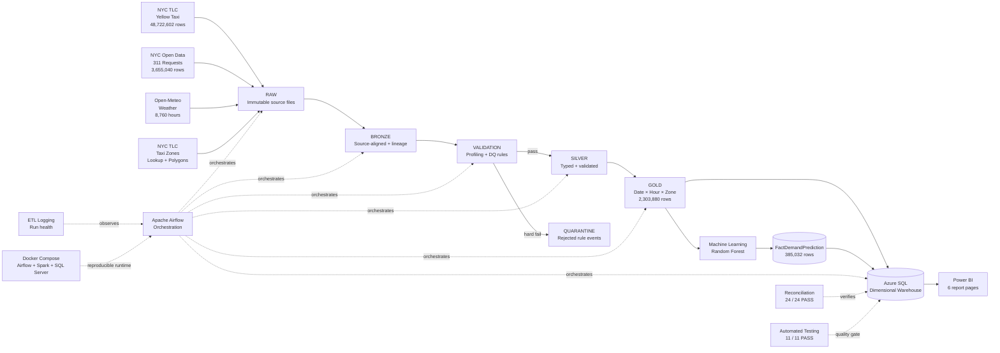

### Architectural responsibilities

| Component | Responsibility |
|---|---|
| **Raw** | Preserve exact source downloads |
| **Bronze** | Persist source-aligned records with minimal transformation and lineage |
| **Validation** | Profile, validate, classify, and route records |
| **Silver** | Store typed, standardized, analytically valid data |
| **Quarantine** | Preserve hard-failed record/rule events with reasons |
| **Gold** | Produce business-ready `date × hour × zone` activity |
| **Azure SQL** | Serve the dimensional analytical warehouse |
| **Machine Learning** | Forecast zone-hour taxi demand |
| **Power BI** | Present governed analytical and forecast results |
| **Airflow** | Coordinate monthly end-to-end execution |
| **Logging** | Record run status, counts, and errors |
| **Reconciliation** | Prove that layer differences are explainable |
| **pytest / SQL validation** | Enforce critical post-load controls |
| **Docker** | Reproduce Airflow, Spark, PostgreSQL, and SQL Server runtime components |

---

[⬆️ Back to top](#-nyc-urban-intelligence-platform)

# 📦 Data Sources

The project integrates **four independent sources**.

| Source | Coverage | Raw volume / role | Format / access | Primary purpose |
|---|---|---:|---|---|
| **NYC TLC Yellow Taxi Trips** | Jan–Dec 2025 | **48,722,602** rows | Monthly Parquet | Demand, revenue, fare, distance, pickup/drop-off activity |
| **NYC 311 Service Requests** | Jan–Dec 2025 | **3,655,040** rows | NYC Open Data JSON API with pagination | Civic complaint activity |
| **Open-Meteo Historical Weather** | Jan–Dec 2025 | **8,760** hourly rows | Historical Weather API | Temperature, rain, snow, condition context |
| **NYC TLC Taxi Zones** | Reference | **263 authoritative analytical zones** plus TLC special IDs outside the polygon domain | Lookup CSV + geographic polygons | Zone, borough, service-zone enrichment and 311 point-in-polygon mapping |

### 1. NYC Yellow Taxi Trips

Taxi data is acquired from the official NYC Taxi & Limousine Commission monthly trip-record files.

Source:

```text
https://www.nyc.gov/site/tlc/about/tlc-trip-record-data.page
```

The full-year source contains:

```text
48,722,602 raw taxi trip records
```

Taxi is the dominant source by volume and is therefore where the project uses **PySpark** most heavily.

### 2. NYC 311 Service Requests

The 311 source is retrieved from NYC Open Data using paginated API acquisition.

Source endpoint:

```text
https://data.cityofnewyork.us/resource/erm2-nwe9.json
```

Full-year source volume:

```text
3,655,040 raw service-request records
```

311 records are validated and then spatially assigned to TLC Taxi Zones using their longitude and latitude.

### 3. Historical Weather

Historical hourly weather is acquired from Open-Meteo.

Source:

```text
https://open-meteo.com/en/docs/historical-weather-api
```

The final 2025 weather series contains exactly:

```text
365 days × 24 hours = 8,760 hourly observations
```

Validation confirmed:

```text
Missing hourly periods : 0
Duplicate hourly periods: 0
Rejected weather rows   : 0
```

### 4. Taxi Zone Reference and Geography

Official TLC Taxi Zone lookup and polygon geography provide the spatial domain.

The authoritative Gold analytical domain uses:

```text
LocationID 1 … 263
```

TLC special pickup IDs `264` and `265` are retained in Silver for source fidelity but are **not authoritative polygon zones**, so they are excluded from the zone-based Gold domain and reconciled explicitly.

---

[⬆️ Back to top](#-nyc-urban-intelligence-platform)

# 🧭 Engineering Principles

The platform was built around several non-negotiable engineering rules.

### Immutable source preservation

Raw data is never manually edited to make downstream processing easier. Corrections happen in governed downstream layers.

### No silent deletion

A record that violates a hard business rule is routed to **Quarantine** with its rejection reason rather than disappearing from the pipeline.

### Suspicious does not automatically mean invalid

The project distinguishes between:

- **structurally invalid records** that cannot be trusted analytically; and
- **candidate anomalies** that look unusual but may represent legitimate adjustments, refunds, rare trips, or operational edge cases.

This distinction is especially important for NYC Taxi monetary values.

### Explicit analytical grain

Gold is not an arbitrary flat file. Its grain is explicitly:

```text
one row per date × hour × authoritative taxi zone
```

### Reconciliation before trust

Source, Silver, Quarantine, Gold, SQL, ML, and Power BI totals are validated using explicit control equations.

### Time-respecting machine learning

Historical and future periods are not randomly mixed. The test period is strictly later than the training period.

### Secrets stay outside source code

Database credentials are supplied through environment variables and Airflow connections, never committed to Git.

---

[⬆️ Back to top](#-nyc-urban-intelligence-platform)

# 🥉 Raw → Bronze → Validation → Silver → Quarantine → Gold

## RAW — immutable landing layer

Raw contains the exact downloaded source artifacts.

```text
data/raw/
```

Raw responsibilities:

- preserve original Parquet, JSON/API, CSV, and geographic files;
- provide an immutable restart point;
- maintain source reproducibility;
- avoid business-rule transformations;
- allow any Silver or Gold record to be investigated against its origin.

**Raw is evidence, not a cleaning layer.**

---

## 🥉 BRONZE — source-aligned persistent layer

Bronze converts the raw landing data into a stable processing representation without applying aggressive business cleaning.

```text
data/bronze/
```

The Taxi Bronze pipeline is implemented with:

```text
spark/build_taxi_bronze.py
```

Bronze design goals:

- preserve the source structure as closely as practical;
- establish controlled schemas;
- preserve lineage metadata;
- support month-scoped processing;
- persist data efficiently in Parquet;
- provide a stable input for profiling and validation.

For the highest-volume Taxi source, PySpark prevents the architecture from relying on a single in-memory pandas operation across all `48.7M` records.

---

## 🔍 VALIDATION — profile first, classify second

Validation occurs between Bronze and Silver.

Taxi Bronze validation is implemented in:

```text
spark/validate_taxi_bronze.py
```

The validation layer checks structural quality such as:

- schema expectations;
- required fields;
- timestamp validity;
- date-domain consistency;
- location validity;
- impossible numeric conditions;
- duplicates;
- profile-based warning conditions.

The project deliberately did **not** create every hard rule from intuition. Profiling was used to distinguish invalid conditions from unusual-but-possible source behavior.

---

## 🥈 SILVER — typed, standardized, accepted analytical data

Silver contains records accepted after hard-quality validation.

```text
data/silver/
```

Key preparation scripts include:

```text
spark/build_taxi_silver.py
python/prepare_311_silver.py
python/prepare_weather_silver.py
python/map_311_to_taxi_zones.py
```

Final accepted row counts:

| Dataset | Raw | Silver valid | Distinct rejected |
|---|---:|---:|---:|
| Taxi | 48,722,602 | **48,720,337** | **2,265** |
| 311 | 3,655,040 | **3,604,061** | **50,979** |
| Weather | 8,760 | **8,760** | **0** |
| **Total** | **52,386,402** | **52,333,158** | **53,244** |

Control equation:

```text
52,386,402 Raw
=
52,333,158 Silver-valid
+
53,244 distinct rejected
```

Variance:

```text
0
```

---

## 🚨 QUARANTINE — rejected records remain inspectable

Quarantine stores records that fail hard validation.

```text
data/quarantine/
```

A critical design detail is that quarantine is stored at **record–rule failure event** grain. One source record may therefore appear more than once when it violates more than one rule.

### Taxi quarantine

```text
Distinct rejected Taxi records : 2,265
Taxi quarantine events         : 2,265
```

### 311 quarantine

Hard-rule counts:

```text
Missing coordinates       : 50,148
Closed before created     :    914
Physical rule-failure rows: 51,062
Distinct rejected records : 50,979
Overlap across both rules :     83
```

The apparent difference is intentional:

```text
50,148 + 914 = 51,062 rule-failure events

51,062 events - 83 overlapping second failures
= 50,979 distinct rejected source records
```

### Total quarantine event rows

```text
Taxi events    :  2,265
311 events     : 51,062
Weather events :      0
-----------------------------
Total events   : 53,327
```

This differs from the `53,244` distinct rejected records because **83 311 records fail two hard rules**.

Each quarantined event retains enough context to explain:

- what failed;
- why it failed;
- which run processed it;
- which source record it came from.

---

## 🥇 GOLD — business-ready dense analytical layer

Gold is the canonical analytical layer.

```text
data/gold/
```

Primary builder:

```text
python/build_gold_zone_hourly.py
```

Gold grain:

```text
NYC local date × hour × TLC Taxi Zone
```

The platform creates a **dense grid**, not only rows where activity happened:

```text
263 zones × 8,760 hours = 2,303,880 Gold rows
```

This has several benefits:

- zero-demand hours remain visible;
- time-series analysis is continuous;
- ML training does not silently omit zero-activity combinations;
- Power BI can compare consistent time/zone populations;
- expected row count is mathematically testable.

Primary Gold measures include:

```text
date
hour
taxi_zone_id
taxi_zone_name
borough
taxi_trips
taxi_revenue
average_fare
average_trip_distance
complaints_311
temperature_c
rain_mm
snowfall_cm
weather_condition
...
```

---

[⬆️ Back to top](#-nyc-urban-intelligence-platform)

# 🛡️ Data Quality Decisions

One of the most important parts of the project is not simply *having rules*, but documenting **why a condition is rejected, retained, or only flagged**.

## Taxi — hard rejection versus Flag & Retain

Final Taxi reconciliation:

```text
Raw Taxi    : 48,722,602
Silver Taxi : 48,720,337
Rejected    :      2,265
```

Hard rejection rate:

```text
2,265 / 48,722,602 = 0.00465%
```

That very low rate is intentional. The pipeline does **not** convert every unusual value into data loss.

### Structurally invalid examples

A value such as **negative trip distance** is physically/structurally invalid and is treated as a critical quality failure.

Other hard checks cover required structural, temporal, location, and schema validity.

### Candidate anomalies retained after profiling

The following conditions were observed and profiled but were **not automatically treated as hard rejections**:

| Candidate anomaly | Observed count | Policy |
|---|---:|---|
| Negative `fare_amount` | ~**2,848,620** | Flag and retain |
| Negative `total_amount` | ~**973,721** | Flag and retain |
| Fare ≥ 900 | **145** | Flag / investigate |
| Trip distance ≥ 150 miles | **2,348** | Flag / investigate |
| Duration ≥ 10 hours | **12,989** | Flag / investigate |
| Passenger count ≤ 0 | **260,062** | Flag / investigate |
| Passenger count > 6 | **146** | Flag / investigate |

These warning counts are **not mutually exclusive** and should not be added together as a count of distinct bad records.

The most important business-rule decision concerns negative monetary values. Negative Taxi fares or totals may reflect:

- refunds;
- reversals;
- corrections;
- operational adjustments;
- other legitimate source-system behavior.

Without authoritative business evidence proving those rows are invalid, deleting millions of them would make the cleaned dataset less faithful to the source.

Therefore:

> **Negative fare and negative total are candidate anomalies, not automatic rejection rules.**

A direct consequence is that a small number of aggregated Gold zone-hours may have negative `taxi_revenue` or `average_fare`. This is **expected under the documented policy** and is why the automated test suite does not assert that those two measures must always be non-negative.

---

## 311 — hard quality failures

Final 311 reconciliation:

```text
Raw 311              : 3,655,040
Silver valid         : 3,604,061
Distinct rejected    :    50,979
Quarantine rule rows :    51,062
```

Hard rules:

| Rule | Count | Treatment |
|---|---:|---|
| Missing longitude/latitude required for spatial analysis | **50,148** | Quarantine |
| `closed_date < created_date` | **914** | Quarantine |
| Records violating both rules | **83** | Two quarantine events, one distinct rejected record |
| Duplicate business key | **0** | No duplicates found |

The dominant quality problem is therefore **missing geospatial coordinates**, not duplicate request IDs.

A separate long-resolution condition was treated as a **warning rather than a hard rejection**. The final profiling identified approximately **4,976** very-long-resolution records for investigation.

---

## Weather — completeness is a contract

Weather quality checks produced:

```text
Expected hourly records : 8,760
Actual Silver records    : 8,760
Missing hours            : 0
Duplicate hours          : 0
Rejected records         : 0
```

The pipeline does not silently interpolate a missing weather hour during normal Gold construction. Full weather coverage is treated as a data contract.

---

## Overall quality outcome

```text
Core raw records      : 52,386,402
Core valid records    : 52,333,158
Distinct rejected     :     53,244
Overall rejected rate :   0.10164%
Exact duplicate rows  :          1
```


---

[⬆️ Back to top](#-nyc-urban-intelligence-platform)

# 🗺️ Geospatial Mapping

311 requests do not naturally share the Taxi Zone key used by Taxi data. The project therefore performs explicit **point-in-polygon spatial mapping**.

Pipeline:

```text
311 longitude + latitude
        ↓
Create geographic point
        ↓
Official TLC Taxi Zone polygons
        ↓
Point-in-polygon assignment
        ↓
LocationID + Zone + Borough
```

Final mapping reconciliation:

```text
311 Silver valid                   : 3,604,061
Mapped inside authoritative zones : 3,603,396
Valid points outside polygons     :       665
```

Mapping rate among valid Silver records:

```text
3,603,396 / 3,604,061 = 99.9815%
```

The `665` outside-polygon records are **not silently forced into a nearby zone**. They remain explainable in reconciliation and are excluded from the authoritative zone-level Gold complaint count.

Taxi uses the same authoritative spatial domain. `103,042` Silver Taxi trips have special pickup Location IDs `264` or `265`, which are outside the `1…263` polygon domain used for zone-based analysis.

---

[⬆️ Back to top](#-nyc-urban-intelligence-platform)

# ⚡ PySpark and Processing Strategy

The processing stack deliberately uses the right tool for each workload instead of forcing the entire project into one framework.

## Why PySpark is used

Taxi data contains:

```text
48,722,602 raw trips
```

That is the dominant volume in the project. PySpark is therefore used for the large Taxi Bronze/Silver path:

```text
Raw Taxi Parquet
      ↓
spark/build_taxi_bronze.py
      ↓
spark/validate_taxi_bronze.py
      ↓
spark/build_taxi_silver.py
```

PySpark supports:

- distributed processing;
- schema-controlled transformations;
- efficient Parquet input/output;
- partition-aware monthly execution;
- large-scale validation without loading the full Taxi source into a single pandas DataFrame.

## Python / pandas / PyArrow responsibilities

Python-based processing is used where it is more appropriate, including:

- acquisition;
- 311 preparation;
- weather preparation;
- geospatial mapping;
- Gold dense-grid construction and aggregation;
- Azure SQL loading;
- reconciliation;
- ML feature engineering and Scikit-learn models;
- warehouse validation.

The project is therefore **hybrid by design**:

```text
PySpark  → highest-volume Taxi transformations
Python   → orchestration helpers, 311, weather, spatial, Gold, SQL, ML
SQL      → dimensional serving, validation, analysis
Power BI → semantic reporting and visual analytics
```

## Distributed Spark runtime validation

The Docker environment was validated with a real Spark master/worker configuration.

Observed runtime:

```text
Apache Spark : 4.2.0
Java         : 17.0.20.1
OS           : Linux under WSL2 / Docker
```

A distributed smoke test executed:

```python
spark.range(1000).repartition(4).count()
```

against:

```text
spark://spark-master:7077
```

to verify that the containerized Spark runtime was operational.

---

[⬆️ Back to top](#-nyc-urban-intelligence-platform)

# 🥇 Gold Analytical Dataset

Gold is more than an aggregation file: it is the **shared analytical contract** used by the warehouse, Power BI, and ML.

## Taxi Silver → Gold

```text
Taxi Silver-valid                       : 48,720,337
Special pickup LocationID 264/265      :    103,042
Authoritative zone-domain Gold trips   : 48,617,295
```

Control equation:

```text
48,720,337 - 103,042 = 48,617,295
```

Gold Taxi revenue:

```text
$1,306,369,662.27
```

The principal revenue definition is based on the sum of `total_amount` for Silver Taxi trips included in the authoritative pickup-zone domain.

## 311 Silver → Gold

```text
311 Silver-valid                  : 3,604,061
Valid points outside TLC polygons:       665
Gold complaint count             : 3,603,396
```

Control equation:

```text
3,604,061 - 665 = 3,603,396
```

## Weather → Gold

```text
Weather Silver : 8,760 hourly records
Gold grid      : 2,303,880 zone-hours
```

The same city-level hourly observation is associated with every zone for a given hour. This gives a consistent weather context across the dense grid, while also creating a documented spatial limitation discussed later.

## Gold internal controls

`python/build_gold_zone_hourly.py` verifies, among other things:

- no duplicate `date + hour + zone`;
- expected dense-grid row count;
- Taxi trip totals;
- Taxi revenue totals;
- 311 complaint totals;
- required weather completeness;
- required keys and domain consistency.

---

[⬆️ Back to top](#-nyc-urban-intelligence-platform)

# 🗄️ Azure SQL Data Warehouse

The Gold layer is loaded into a dedicated dimensional warehouse:

```text
Database: NYC_Urban_Intelligence_DW
Schema  : dw
Platform: Azure SQL Database
```

Credentials are **not** stored in the repository.

## Dimensional model

Primary dimensions:

```text
dw.DimDate
dw.DimTime
dw.DimZone
dw.DimWeatherCondition
```

Primary analytical facts / aggregates:

```text
dw.FactZoneHourlyActivity
dw.FactDemandPrediction
dw.AggTaxiDropoffZoneDaily
```

`FactZoneHourlyActivity` is the principal Gold serving fact:

```text
2,303,880 rows
```

`FactDemandPrediction` stores the final test-period forecasts:

```text
385,032 rows
```

`AggTaxiDropoffZoneDaily` supports Power BI drop-off-location analysis:

```text
92,195 rows
```

Detailed Taxi and 311 fact-table structures are retained as schema-level extensions, while the submission's primary analytical workload is served from the governed aggregate facts.

## Core dimension semantics

### `dw.DimDate`

Contains the analytical calendar. A technical `1900` unknown/default member exists for warehouse integrity. Power BI removes that technical member from normal report analysis and marks `full_date` as the report date table.

### `dw.DimTime`

Includes:

```text
time_key
hour_of_day
hour_label
daypart
```

### `dw.DimZone`

Includes:

```text
zone_key
location_id
zone_name
borough
service_zone
```

### `dw.DimWeatherCondition`

Includes:

```text
weather_condition_key
weather_code
weather_condition
```

## Star schema


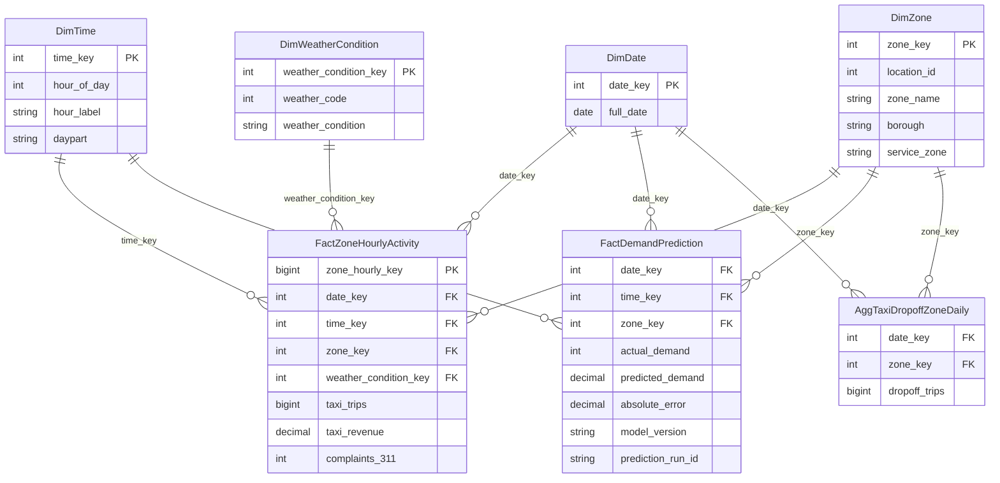

## Warehouse health and quality views

The reporting layer also exposes governance views:

```text
dw.vw_DataQualitySummary
dw.vw_DataQualityIssueSummary
dw.vw_PipelineHealth
dw.vw_ETLRunHealth
dw.vw_ReconciliationHealth
```

These allow Power BI to surface pipeline and quality information without reading raw log files directly.

---

[⬆️ Back to top](#-nyc-urban-intelligence-platform)

# 🔄 Incremental Loading and Duplicate Prevention

The platform is designed for **month-scoped, repeatable loading**, not only one full historical rebuild.

Primary loader:

```text
python/load_gold_incremental_logged.py
```

Airflow passes:

```text
--year 2025
--start-month <1..12>
--end-month <1..12>
```

The pipeline therefore knows the exact processing scope and can operate on a selected monthly range.

## Incremental design

The implementation uses the following concepts:

- month-scoped Gold inputs;
- a processed-file / processed-scope registry;
- last-successful-run tracking;
- controlled reload/upsert behavior;
- post-load validation;
- ETL run logging.

This allows a new month to be processed without unnecessarily rebuilding the full year.

## Duplicate prevention

Duplicate prevention exists at multiple levels:

```text
Source/processing layer
    ↓
deduplication and business-key checks
    ↓
Gold unique business grain
    ↓
warehouse constraints / validation
    ↓
automated duplicate tests
```

The authoritative Gold business key is:

```text
date_key + time_key + zone_key
```

Phase 17 SQL validation is stored under:

```text
sql/phase17/01_validate_duplicate_prevention.sql
sql/phase17/02_validate_idempotent_rerun.sql
```

The same logical load can be rerun without creating a second copy of the same zone-hour facts.

Phase 40 independently re-tests both:

- duplicate Gold business keys; and
- duplicate Gold surrogate keys.

Both final checks pass with:

```text
0 duplicate groups
```

---

[⬆️ Back to top](#-nyc-urban-intelligence-platform)

# 🧾 ETL Logging and Failure Handling

The project includes formal ETL observability rather than relying only on terminal output.

Implementation:

```text
python/etl_logging.py

sql/phase18/01_create_etl_logging.sql
sql/phase18/02_test_etl_logging.sql
sql/phase18/03_validate_etl_logging.sql
```

Run metadata captures information such as:

```text
run_id
source
processing_month
stage
start_time
end_time
rows_processed
rows_valid
rows_rejected
status
error_message
```

This supports:

- run-level traceability;
- last-successful-run reporting;
- Power BI pipeline-health indicators;
- troubleshooting;
- reconciliation of accepted/rejected counts.

## Failure-handling behavior

Critical stages are deliberately configured to fail loudly when a contract is violated.

Examples include:

- missing expected source files;
- invalid month range;
- schema/required-field failures;
- wrong Gold row count;
- broken dimensional relationships;
- reconciliation mismatch;
- SQL post-load validation failure;
- pytest failure.

Airflow shell tasks use:

```bash
set -euo pipefail
```

and the SQL warehouse, post-load validation, and final pytest tasks use:

```text
retries     = 2
retry_delay = 1 minute
```

This protects the pipeline from both silent command failures and transient infrastructure problems.

---

[⬆️ Back to top](#-nyc-urban-intelligence-platform)

# 🌬️ Airflow Orchestration

The pipeline is orchestrated by:

```text
dags/nyc_urban_intelligence_dag.py
```

DAG ID:

```text
nyc_urban_intelligence_pipeline
```

The current DAG is parameterized rather than hardcoded to one specific month.

Parameters:

```text
start_month: 1 … 12
end_month  : 1 … 12
```

It validates:

```text
start_month <= end_month
```

The default scope is one month, which keeps routine execution controlled and supports the incremental-loading design.

## Final orchestration chain

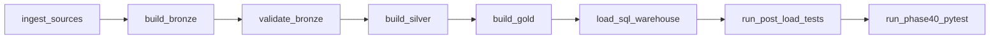

The tasks call the existing production scripts instead of duplicating ETL logic inside the DAG.

### Ingestion

```text
python/acquisition/download_taxi.py
python/acquisition/download_311.py
python/acquisition/download_weather.py
python/acquisition/download_taxi_zones.py
```

### Bronze

```text
spark/build_taxi_bronze.py
```

### Validation

```text
spark/validate_taxi_bronze.py
```

### Silver

```text
spark/build_taxi_silver.py
python/prepare_311_silver.py
python/prepare_weather_silver.py
python/map_311_to_taxi_zones.py
```

### Gold

```text
python/build_gold_zone_hourly.py
```

### Warehouse load

```text
python/load_gold_incremental_logged.py
```

### Post-load validation

```text
python/validate_phase19_warehouse.py
```

### Final automated quality gate

```text
python -m pytest tests/test_warehouse_quality.py -q
```

## Runtime configuration

The current DAG reduces machine-specific coupling by resolving:

```text
NYC_PROJECT_ROOT
NYC_ETL_PYTHON
```

from environment variables, with sensible defaults.

Azure SQL credentials are populated from an Airflow connection into environment variables at runtime rather than being written into the DAG.


---

[⬆️ Back to top](#-nyc-urban-intelligence-platform)

# 🐳 Docker Environment

Docker is used to make the orchestration and data-engineering runtime reproducible.

Relevant repository files:

```text
.dockerignore
docker/.env.example
docker/Dockerfile
docker/README.md
docker/docker-compose.yml
docker/init_warehouse.sh
docker/requirements-docker.txt
docker/spark_smoke_test.py
```

The validated Compose environment includes:

| Service | Runtime / image | Purpose |
|---|---|---|
| `airflow-api-server` | `nyc-urban-airflow:phase21` | Airflow UI/API |
| `airflow-dag-processor` | `nyc-urban-airflow:phase21` | DAG parsing |
| `airflow-scheduler` | `nyc-urban-airflow:phase21` | Scheduling / orchestration |
| `postgres` | `postgres:16` | Airflow metadata database |
| `spark-master` | project Airflow/Spark image | Spark cluster master |
| `spark-worker` | project Airflow/Spark image | Spark executor |
| `sqlserver` | `mcr.microsoft.com/mssql/server:2022-latest` | Reproducible local SQL Server runtime |

Validated host mappings included:

```text
Airflow UI/API : localhost:8081
Spark Master UI: localhost:8082
Spark Worker UI: localhost:8083
Spark cluster   : 7077
SQL Server      : 1433
```

The Docker SQL Server environment is the **reproducible local/development warehouse runtime**. The primary serving warehouse used for final governed reporting is **Azure SQL**.


---

[⬆️ Back to top](#-nyc-urban-intelligence-platform)

# 🔎 SQL Analysis and Performance Optimization

The project includes a dedicated analytical SQL phase rather than relying only on DAX.

Main analytical script:

```text
sql/phase22/01_sql_analysis.sql
```

The SQL analysis suite contains **15+ analytical queries** covering the required analytical patterns, including:

- aggregations;
- dimensional joins;
- ranking;
- CTEs;
- `CASE` logic;
- date logic;
- window functions;
- `LAG`;
- rolling and comparative analysis.

## Performance optimization

Three heavier analytical patterns were selected for focused tuning:

```text
Q05 — Month-over-month growth
Q14 — Demand-spike analysis
Q15 — Rolling analysis
```

Artifacts include:

```text
reports/sql_performance/q05_mom_growth_optimization.md
reports/sql_performance/q14_spike_optimization.md
reports/sql_performance/q15_rolling_optimization.md
```

and captured original/optimized execution plans:

```text
reports/sql_performance/execution_plans/q05_original.sqlplan
reports/sql_performance/execution_plans/q05_optimized.sqlplan
reports/sql_performance/execution_plans/q14_original.sqlplan
reports/sql_performance/execution_plans/q14_optimized.sqlplan
reports/sql_performance/execution_plans/q15_original.sqlplan
reports/sql_performance/execution_plans/q15_optimized.sqlplan
```

The optimized implementation also includes:

```text
sql/phase23/01_create_daily_aggregate.sql
sql/phase23/02_optimized_queries.sql
```

This phase provides reproducible before/after execution-plan evidence rather than claiming performance improvements without supporting artifacts.

> 📊 **Add chart:** build this comparison from the captured execution plans in `reports/sql_performance/execution_plans/` (Q05, Q14, Q15 — original vs. optimized) and save it to `documentation/images/sql_performance_comparison.png`. It will then render automatically below.
>
> 

---

[⬆️ Back to top](#-nyc-urban-intelligence-platform)

# 🤖 Machine Learning

The ML objective is:

```text
Predict taxi trips for each Taxi Zone at each hour.
```

The forecasting pipeline is built from the same governed analytical platform used by SQL and Power BI.

Relevant implementation includes:

```text
model/build_demand_features.py
model/baseline_model.py
model/train_ml_models.py
model/evaluate_model.py
model/feature_importance.py
model/feature_spec.md
```

with dedicated validation scripts for:

- feature construction;
- lag alignment;
- baseline output;
- model comparison;
- time-based testing;
- evaluation;
- feature importance.

## Prediction grain

```text
Taxi Zone × Hour
```

## Feature families

The feature set combines governed information available at prediction time, including:

- historical demand / lagged demand, including a **168-hour weekly lag**;
- hour and other calendar/time features;
- Taxi Zone / location;
- weather context;
- 311 complaint activity.

The project explicitly validates lag alignment so that future information is not accidentally used to predict the past.

## Warm-up period

Lag-based feature construction requires history before the first fully model-ready row.

Final model-ready population:

```text
2,259,696 zone-hour rows
```

This begins after the required `168-hour` warm-up period.

## Strict time-based split

The platform does **not** randomly shuffle historical and future observations.

```text
Training period : 2025-01-08 through 2025-10-31
Training rows   : 1,874,664

Testing period  : 2025-11-01 through 2025-12-31
Testing rows    :   385,032
```

Test-count proof:

```text
61 days × 24 hours × 263 zones
= 385,032 rows
```

This design tests the actual question:

> Can a model trained only on earlier 2025 observations generalize to the unseen November–December period?

---

[⬆️ Back to top](#-nyc-urban-intelligence-platform)

# 📈 Model Results

Three forecasting approaches were compared on the same future test period.

| Model | MAE ↓ | RMSE ↓ | R² ↑ | Outcome |
|---|---:|---:|---:|---|
| Weekly-lag baseline (`lag_168`) | **6.7707** | **22.9201** | **0.8626** | Benchmark |
| HistGradientBoostingRegressor | **4.2347** | **12.1401** | **0.96145** | Strong challenger |
| **Random Forest Regressor** | **4.1399** | **12.0792** | **0.961836** | **Selected** |

Random Forest was selected because it produced the strongest overall combination of the primary evaluation metrics on the held-out future period.

### Improvement over the weekly-lag baseline

MAE improvement:

```text
6.7707 → 4.1399
38.86% reduction
```

RMSE improvement:

```text
22.9201 → 12.0792
47.30% reduction
```

R² improvement:

```text
0.8626 → 0.961836
```

These results demonstrate that the selected model does more than repeat the previous week's demand pattern.

## Evaluation dimensions

Model evaluation artifacts are persisted for analysis at multiple levels:

```text
reports/model_evaluation/overall_metrics.csv
reports/model_evaluation/by_zone.csv
reports/model_evaluation/by_hour.csv
reports/model_evaluation/by_day_of_week.csv
reports/model_evaluation/by_demand_level.csv
```

This is important because a single global metric can hide poor performance in particular zones, hours, or demand ranges.

## Feature importance

Feature influence is measured rather than assumed.

The project persists:

```text
reports/feature_importance/random_forest_impurity.csv
reports/feature_importance/random_forest_permutation.csv
reports/feature_importance/grouped_permutation.csv
```

This provides three complementary views of model influence:

- tree impurity importance;
- permutation importance;
- grouped permutation importance.


> 📊 **Add chart:** generate this from `reports/feature_importance/random_forest_impurity.csv`, `random_forest_permutation.csv`, and `grouped_permutation.csv` (top 10–15 features per method) and save it to `documentation/images/feature_importance.png`. It will then render automatically below.
>
> 

### MAPE caution

Normal MAPE is unstable when actual demand is zero. Because the dense Gold grid intentionally preserves zero-demand zone-hours, the project prioritizes:

```text
MAE
RMSE
R²
```

and treats percentage-error interpretation carefully rather than presenting misleading infinite/undefined MAPE values.

---

[⬆️ Back to top](#-nyc-urban-intelligence-platform)

# 💾 Prediction Storage

Predictions are not left only in a local model artifact.

They are written back to the analytical platform:

```text
dw.FactDemandPrediction
```

Final stored prediction count:

```text
385,032
```

Model metadata:

```text
Model version      : phase26_rf_v1
Prediction run ID  : 25571b64-b788-530a-93f1-4b8b9473f8d0
```

The prediction fact contains analytical fields such as:

```text
date_key
time_key
zone_key
actual_demand
predicted_demand
absolute_error
percentage_error / error context
model_version
prediction_run_id
```

This makes the same predictions directly available to Power BI for Actual-vs-Predicted analysis.

Validation confirms that all prediction Date, Time, and Zone foreign keys resolve successfully.

---

[⬆️ Back to top](#-nyc-urban-intelligence-platform)

# 📊 Power BI

The final Power BI report uses the **Azure SQL dimensional warehouse in Import mode**.

Semantic-model rules:

```text
Dimensions  1 ─── *  Facts
Single-direction filtering
No fact-to-fact relationships
DimDate marked as the Date table
```

The technical `1900` DimDate member is filtered from ordinary analytical reporting.

## Page 1 — Executive Overview

Purpose: provide an immediate business summary.

Measures and visuals include:

- Total Trips;
- Total Revenue;
- Average Fare;
- Total Complaints;
- Average Temperature;
- Taxi demand trend;
- Revenue trend;
- Top Taxi Zones.

Validated full-year KPI totals:

```text
Trips      : 48,617,295
Revenue    : $1,306,369,662.27
Complaints : 3,603,396
```

> 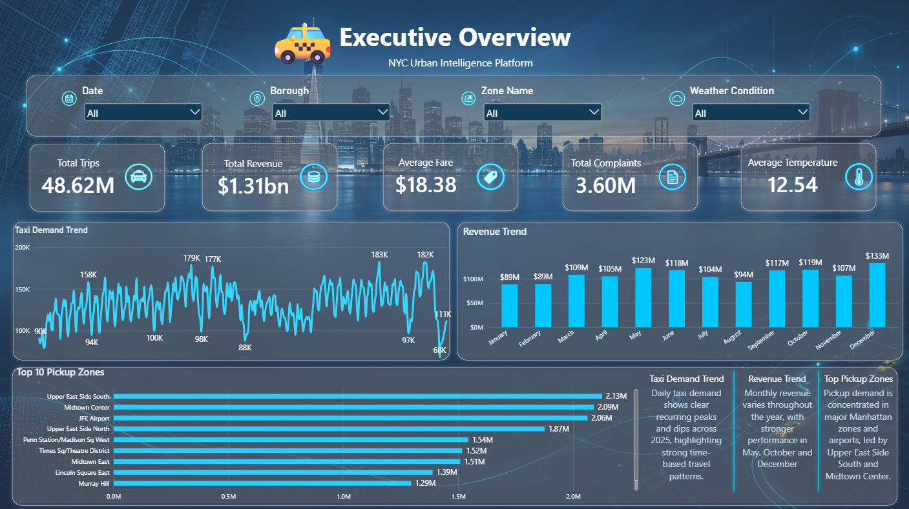

## Page 2 — Location Analysis

Purpose: understand how activity differs spatially.

Includes:

- Top Pickup Zones;
- Top Drop-off Zones;
- Borough performance;
- Taxi activity by zone;
- Revenue by location;
- Complaints by location;
- daily drop-off analysis from `dw.AggTaxiDropoffZoneDaily`.

A validated headline result is:

```text
Top pickup Taxi Zone by full-year trips:
Upper East Side South — 2,125,550 trips
```

> 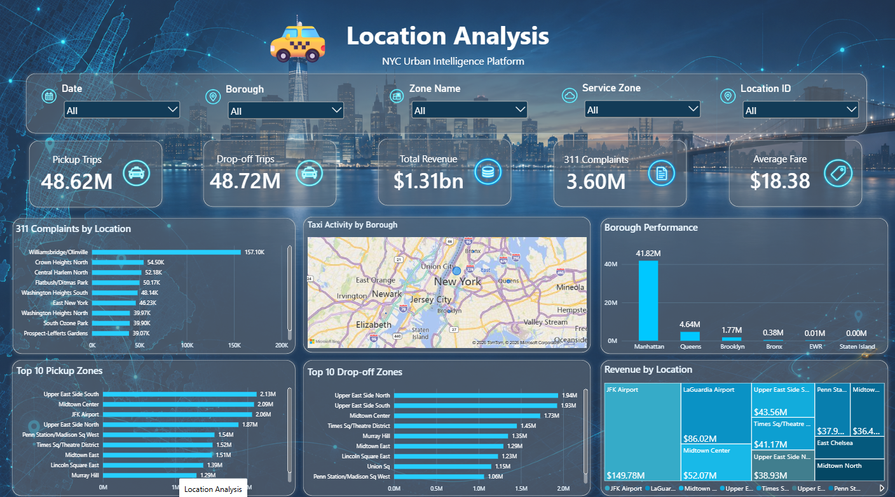

## Page 3 — Time Analysis

Purpose: expose temporal demand structure.

Includes:

- Trips by hour;
- Trips by day;
- Trips by month;
- Peak vs off-peak;
- Weekday vs weekend;
- Hour × Day-of-Week demand heatmap;
- rolling and comparison measures.

> 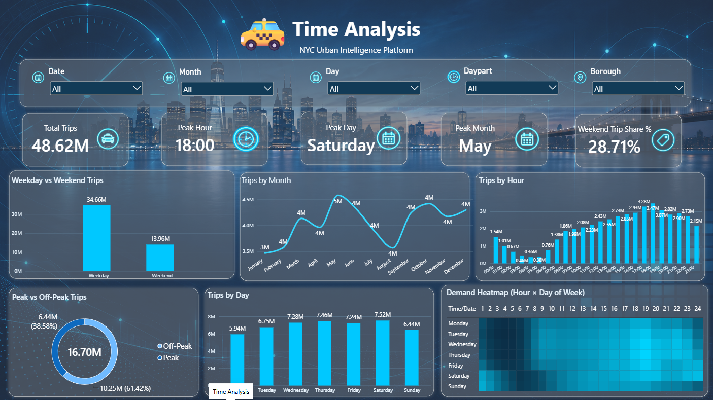

## Page 4 — Weather & Urban Activity

Purpose: compare mobility and civic activity with weather context.

Includes analysis against:

- temperature;
- rain;
- snow;
- weather condition;
- complaint activity where relevant.

The page is descriptive. It does **not** claim that observed weather relationships are automatically causal.

> 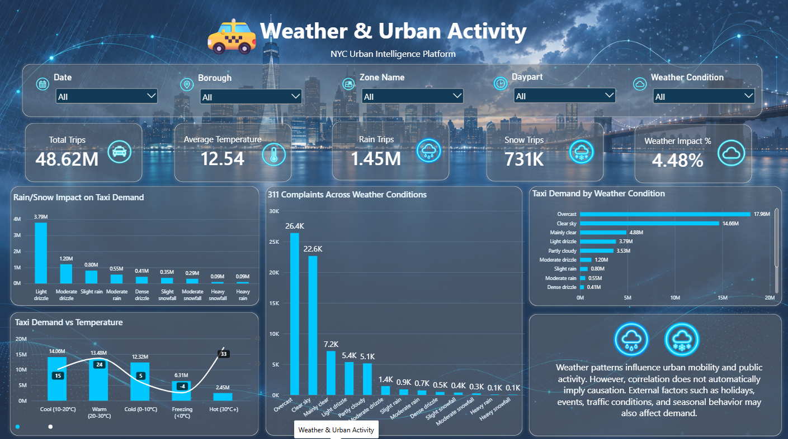

## Page 5 — Forecast Analysis

Purpose: operationalize the stored ML output.

Includes:

- Actual Demand;
- Predicted Demand;
- Forecast Error %;
- MAE;
- error by Zone;
- error by Time;
- best predicted areas;
- worst predicted areas.

The source is the governed `dw.FactDemandPrediction` fact rather than an external spreadsheet.

> 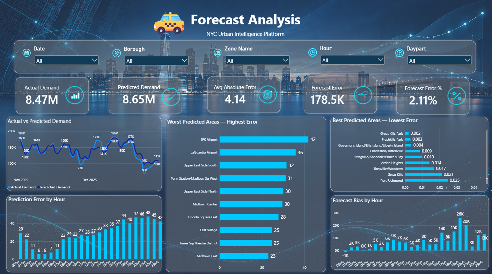

## Page 6 — Data Quality & Pipeline Health

Purpose: make engineering quality visible to report consumers.

Includes:

- Raw Records;
- Valid Records;
- Rejected Records;
- Duplicate Records;
- Quality Issues;
- Rejection Rate;
- Pipeline Status;
- Last Successful Run;
- reconciliation/ETL health.

Important distinction:

```text
Distinct rejected records ≠ all quality issue events/warnings
```

The dashboard's broader Quality Issues metric can include warning and rule-event semantics, whereas the authoritative distinct hard-rejected source count is:

```text
53,244
```

> 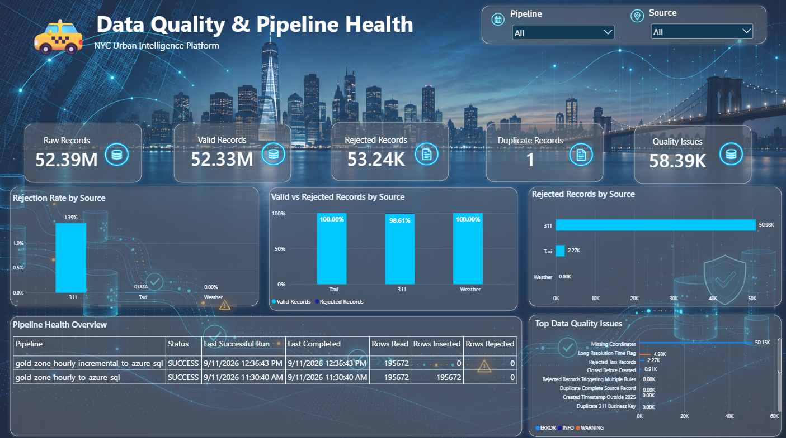

## DAX / semantic measure layer

The report contains measures across multiple categories, including:

```text
Total Trips
Total Revenue
Average Fare
Total Complaints
Average Temperature
Average Trip Distance
Previous Month
Growth %
Rolling 7
Actual Demand
Predicted Demand
Forecast Error %
MAE
Dropoff Trips
Peak / Off-Peak
Weekend Share
Rain Trips
Snow Trips
Weather Impact
Quality Issues
Rejection Rate
```

---

[⬆️ Back to top](#-nyc-urban-intelligence-platform)

# ✅ Reconciliation

Phase 38 formalized source-to-serving reconciliation.

Artifacts:

```text
sql/phase38/01_reconciliation.sql
documentation/phase38_reconciliation.md
```

Final status:

```text
24 / 24 reconciliation checks PASS
```

> 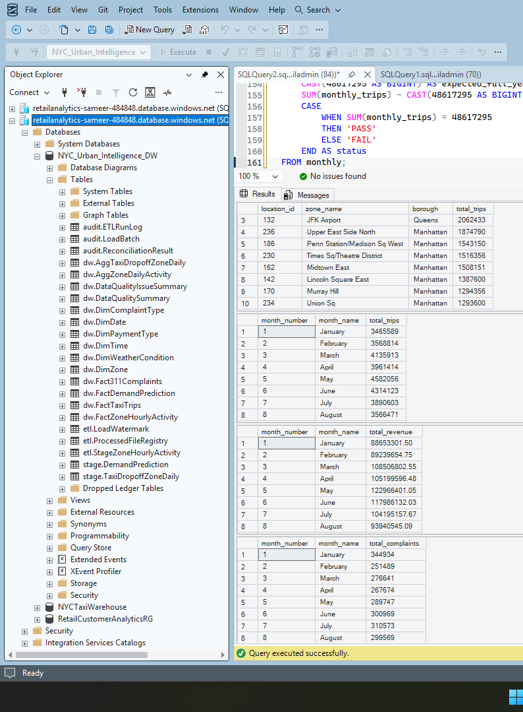
> *Live SQL Server Management Studio session against `NYC_Urban_Intelligence_DW`, cross-checking monthly trip totals with an explicit `CASE … PASS/FAIL` control against the expected full-year figure, alongside borough- and zone-level rollups.*

## Source → Silver + rejected

### Taxi

```text
48,722,602
=
48,720,337 Silver
+
2,265 rejected
```

Variance:

```text
0
```

### 311

```text
3,655,040
=
3,604,061 Silver
+
50,979 distinct rejected
```

Variance:

```text
0
```

### Weather

```text
8,760
=
8,760 Silver
+
0 rejected
```

Variance:

```text
0
```

## Silver → Gold domain reconciliation

### Taxi

```text
48,720,337 Silver
-
103,042 special pickup LocationID 264/265
=
48,617,295 Gold trips
```

### 311

```text
3,604,061 Silver
-
665 valid points outside TLC polygons
=
3,603,396 Gold complaints
```

## Gold grain control

```text
263 zones × 8,760 hours
=
2,303,880 expected rows
=
2,303,880 actual rows
```

This establishes that the final analytical totals differ from Silver for **documented domain reasons**, not because data silently disappeared.

---

[⬆️ Back to top](#-nyc-urban-intelligence-platform)

# 🧪 Automated Testing and Validation

The project uses three complementary validation layers:

```text
Phase 38 — Reconciliation
        ↓
Phase 39 — SQL ↔ Power BI validation
        ↓
Phase 40 — Automated pytest warehouse gate
```

## SQL ↔ Power BI validation

Phase 39 artifacts:

```text
sql/phase39/01_powerbi_validation.sql
documentation/phase39_powerbi_validation.md
```

Full-year exact matches:

| Metric | SQL | Power BI | Difference |
|---|---:|---:|---:|
| Total Trips | 48,617,295 | 48,617,295 | **0** |
| Total Revenue | $1,306,369,662.27 | $1,306,369,662.27 | **0.00** |
| Total Complaints | 3,603,396 | 3,603,396 | **0** |
| Top Taxi Zone | Upper East Side South — 2,125,550 | Same | **Exact** |

Selected month-level control points:

| Month | Trips | Revenue | Complaints |
|---|---:|---:|---:|
| January 2025 | **3,465,589** | **$88,653,301.50** | **344,934** |
| May 2025 | **4,582,056** | **$122,966,401.05** | **289,747** |
| August 2025 | **3,566,471** | **$93,940,545.09** | **299,569** |

The monthly Taxi control total also returns:

```text
48,617,295
```

exactly.

## Phase 40 pytest suite

Main test file:

```text
tests/test_warehouse_quality.py
```

Environment used for the final standalone run:

```text
Python : 3.13.14
pytest : 9.1.1
Azure SQL via pyodbc
```

Automated checks:

| # | Test | Final result |
|---:|---|---|
| 1 | Duplicate Gold business keys `(date_key, time_key, zone_key)` | PASS |
| 2 | Duplicate Gold surrogate keys | PASS |
| 3 | Required Gold fields are non-null | PASS |
| 4 | Gold dates belong to 2025 | PASS |
| 5 | Gold dimensional relationships resolve | PASS |
| 6 | Gold row count = `2,303,880` | PASS |
| 7 | Taxi trip total = `48,617,295` | PASS |
| 8 | 311 complaint total = `3,603,396` | PASS |
| 9 | Structurally invalid Gold measure values absent | PASS |
| 10 | Prediction Date/Time/Zone referential integrity | PASS |
| 11 | Prediction row count = `385,032` | PASS |

Final execution:

```text
11 passed in 4.71s
```

> 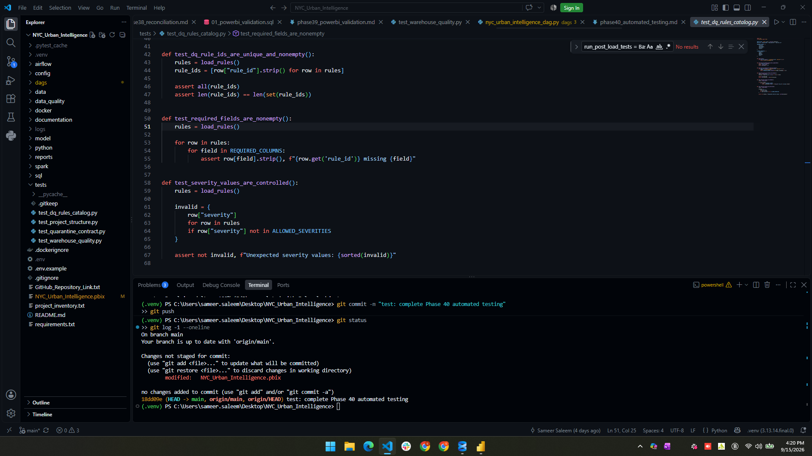
> *`tests/` suite in VS Code — including the data-quality rule-catalog tests (`test_dq_rules_catalog.py`) that assert rule IDs are unique, required fields are non-empty, and severity values stay within `ALLOWED_SEVERITIES` — alongside the terminal history committing and pushing Phase 40.*

## Why the invalid-value test matters

An early version of the Phase 40 test incorrectly treated negative Taxi revenue and average fare as automatic warehouse defects.

That condition flagged:

```text
35,930 Gold rows
```

Investigation showed the **test was wrong**, not the warehouse.

The established Taxi policy intentionally classifies negative monetary values as **Flag and Retain** candidate anomalies. The automated test was therefore corrected to assert only structurally invalid values such as:

```text
taxi_trips < 0
complaints_311 < 0
rain_mm < 0
snowfall_cm < 0
average_trip_distance < 0 where non-null
```

This incident is an important engineering lesson:

> **An automated test is only correct when it enforces the documented business rule. A strict assertion that contradicts the data contract can be more dangerous than having no assertion at all.**

## Airflow quality gate

Phase 40 is integrated as the final DAG task:

```text
run_post_load_tests
        ↓
run_phase40_pytest
```

A warehouse load therefore does not complete its full governed chain until the post-load validation and pytest quality gate have both succeeded.

---

[⬆️ Back to top](#-nyc-urban-intelligence-platform)

# ⚠️ Major Issues Encountered and Resolved

The project encountered real engineering problems across data, infrastructure, analytics, and deployment.

| Issue | Why it mattered | Resolution |
|---|---|---|
| **48.7M Taxi rows** | Full-source processing is too large for a simplistic all-in-memory workflow | Used PySpark for Taxi Bronze/Silver, Parquet, and month-scoped processing |
| **50,148 311 records missing coordinates** | They cannot be reliably assigned to a Taxi Zone | Hard quarantine with explicit reason |
| **914 311 records closed before creation** | Violates temporal logic | Hard quarantine; 83 overlap with missing-coordinate failures |
| **Millions of negative fare/total values** | Blind rejection would remove a large and potentially legitimate part of the source | Profiled separately and classified as Flag & Retain candidate anomalies |
| **Taxi LocationID 264/265** | Not part of authoritative 1…263 Taxi Zone polygons | Excluded `103,042` Silver Taxi rows from zone Gold and reconciled explicitly |
| **665 valid 311 points outside TLC polygons** | Valid coordinates do not guarantee membership in Taxi Zone polygons | Excluded from zone Gold without silently forcing assignment |
| **Cross-partition timestamp edge cases** | Physical file/folder month is not always the same as analytical pickup date | Gold routing follows the actual event timestamp and validates temporal reconciliation |
| **Weather continuity requirement** | Missing hourly weather would corrupt a dense 263-zone hourly grid | Fail on missing weather rather than silently interpolate; final 8,760/8,760 complete |
| **Azure SQL connectivity / pyodbc behavior** | Transient or misconfigured connections can fail automated tests | Moved timeout handling to `pyodbc.connect(..., timeout=60)` and added retry handling |
| **Phase 40 false-positive test** | Incorrectly classified valid retained monetary adjustments as errors | Re-aligned automated tests with the documented DQ policy |
| **Windows vs WSL runtime differences** | Hardcoded project/interpreter paths make orchestration machine-specific | DAG now supports `NYC_PROJECT_ROOT` and `NYC_ETL_PYTHON` environment overrides |
| **Airflow + Spark + SQL runtime complexity** | Reproducing orchestration manually is fragile | Built a Docker Compose environment with Airflow, PostgreSQL, Spark master/worker, and SQL Server |
| **Power BI file size** | Current `.pbix` is approximately `103.22 MB`, above GitHub's normal 100 MB object limit | Keep the current PBIX out of ordinary Git commits; distribute through Git LFS or final external/release packaging |
| **Secrets in automation** | Credentials cannot safely live in scripts or the repository | Environment variables, `.env.example`, and Airflow connection templating |

---

[⬆️ Back to top](#-nyc-urban-intelligence-platform)

# 💡 Major Validated Insights

The formal final business-insight phase can add narrative depth later, but several important findings are already validated by the completed pipeline, warehouse, ML, and Power BI controls.

## 1. The platform successfully governs more than 52 million core records

```text
52,386,402 core raw records
→ 52,333,158 valid
→ 53,244 distinct hard rejects
```

The total distinct rejection rate is only:

```text
0.10164%
```

while every difference is explainable.

## 2. Taxi hard rejection is extremely conservative

Only:

```text
2,265 / 48,722,602 = 0.00465%
```

of Taxi rows are hard-rejected.

This is not evidence that Taxi has no unusual values. It demonstrates the project's deliberate distinction between **invalid** and **anomalous-but-possibly-legitimate** records.

## 3. Missing geography is the dominant 311 hard-quality issue

Of the 311 hard-rule events:

```text
Missing coordinates   : 50,148
Closed-before-created :    914
```

The principal barrier to using 311 records in zone-level analysis is therefore geospatial completeness.

## 4. Nearly all valid 311 records can be mapped to Taxi Zones

```text
3,603,396 / 3,604,061 = 99.9815%
```

of Silver-valid 311 records fall inside authoritative TLC Taxi Zone polygons.

Only:

```text
665
```

valid-coordinate records fall outside the domain.

## 5. Gold is a mathematically complete urban activity lattice

```text
263 zones × 8,760 hours = 2,303,880 rows
```

The dense design explicitly preserves zero-activity combinations, improving temporal analysis and ML consistency.

## 6. Upper East Side South is the validated top pickup zone by trips

The SQL ↔ Power BI control identifies:

```text
Upper East Side South
2,125,550 trips
```

as the full-year top Taxi Zone by pickup trip count.

## 7. Selected validation months show that Taxi activity and 311 complaint volume do not move proportionally

Among the three Phase 39 month controls:

```text
January: 3,465,589 trips | $88.65M revenue  | 344,934 complaints
May    : 4,582,056 trips | $122.97M revenue | 289,747 complaints
August : 3,566,471 trips | $93.94M revenue  | 299,569 complaints
```

May has materially higher Taxi volume and revenue than January or August in this validation sample, while its complaint count is lower than both. That supports treating mobility and civic-complaint activity as related contextual signals rather than interchangeable measures of urban intensity.

## 8. Random Forest materially outperforms the weekly-lag baseline

```text
MAE  : 6.7707 → 4.1399  = 38.86% reduction
RMSE : 22.9201 → 12.0792 = 47.30% reduction
R²   : 0.8626 → 0.961836
```

The final model therefore captures useful demand structure beyond a simple “same hour last week” assumption.

## 9. Dashboard totals are traceable back to SQL

The most important report totals show **zero difference** between Azure SQL and Power BI:

```text
Trips      : exact
Revenue    : exact
Complaints : exact
Top Zone   : exact
```

This is a stronger result than simply observing that the charts “look correct.”

## 10. Domain exclusions are visible rather than hidden

Two important source-to-Gold differences are explicitly accounted for:

```text
103,042 Taxi trips with special pickup IDs 264/265
665 valid 311 points outside Taxi Zone polygons
```

These records do not vanish. Their exclusion is a documented consequence of the authoritative Gold spatial domain.

---

[⬆️ Back to top](#-nyc-urban-intelligence-platform)

# ⚠️ Limitations

A professional analytical platform should state what its results **do not** establish.

### 1. One year of history

The project uses the full 2025 calendar year, which is strong for within-year analysis but does not provide multiple years of history for long-run structural seasonality, year-over-year forecasting, or regime-change analysis.

### 2. Citywide weather context

Weather is represented by one hourly NYC weather series and applied consistently across all Taxi Zones for each hour.

This is appropriate for city-level historical context but does not model:

- borough microclimates;
- localized precipitation;
- hyperlocal weather differences.

### 3. Authoritative Taxi Zone domain

Gold is intentionally restricted to TLC polygon LocationIDs `1…263`.

Therefore:

```text
103,042 Taxi trips with pickup IDs 264/265
```

are outside the authoritative polygon-domain Gold dataset.

### 4. Unmappable 311 records

`50,148` 311 records lack the required coordinates and cannot be responsibly assigned to Taxi Zones.

A further `665` valid-coordinate Silver records fall outside the polygons.

### 5. Retained monetary anomalies

Negative fare and total values are retained where there is insufficient evidence to classify them as structurally invalid.

This means some aggregated monetary values may be negative in a small number of zone-hours. This is intentional source fidelity, not a warehouse arithmetic error.

### 6. External demand drivers are not modeled

The four project sources do not include dedicated feeds for:

- concerts and sporting events;
- flight schedules;
- subway disruptions;
- road closures;
- major traffic incidents;
- holidays/events beyond calendar features.

These could improve forecasting of sudden demand spikes.

### 7. Primary warehouse grain is aggregated

The primary production analytical workload is served from zone-hour and daily aggregate facts. Detailed trip-level and complaint-level fact structures are not the primary loaded reporting facts in the current submission.

### 8. Weather / complaint relationships are correlational

Power BI can show that demand, weather, and complaint activity move together, but that alone does not prove causation.

### 9. Power BI binary packaging

The current Power BI file is approximately `103.22 MB`, above GitHub's normal per-file limit. It requires Git LFS or another release/distribution mechanism for final submission packaging.

---

[⬆️ Back to top](#-nyc-urban-intelligence-platform)

# 🗂️ Repository Structure

The repository separates acquisition, processing, modelling, orchestration, SQL, testing, quality rules, reports, and documentation.

```text
NYC_Urban_Intelligence/
│
├── dags/
│   └── nyc_urban_intelligence_dag.py
│
├── python/
│   ├── acquisition/
│   │   ├── download_taxi.py
│   │   ├── download_311.py
│   │   ├── download_weather.py
│   │   └── download_taxi_zones.py
│   ├── prepare_311_silver.py
│   ├── prepare_weather_silver.py
│   ├── map_311_to_taxi_zones.py
│   ├── build_gold_zone_hourly.py
│   ├── build_dropoff_zone_daily.py
│   ├── load_gold_incremental_logged.py
│   ├── load_demand_predictions_to_azure_sql.py
│   ├── load_dropoff_zone_daily_to_azure_sql.py
│   ├── validate_demand_predictions_azure_sql.py
│   ├── validate_phase19_warehouse.py
│   └── etl_logging.py
│
├── spark/
│   ├── build_taxi_bronze.py
│   ├── validate_taxi_bronze.py
│   └── build_taxi_silver.py
│
├── model/
│   ├── build_demand_features.py
│   ├── baseline_model.py
│   ├── train_ml_models.py
│   ├── evaluate_model.py
│   ├── feature_importance.py
│   ├── feature_spec.md
│   └── validate_*.py
│
├── sql/
│   ├── phase17/
│   ├── phase18/
│   ├── phase22/
│   ├── phase23/
│   ├── phase30/
│   ├── phase38/
│   ├── phase39/
│   └── powerbi_prep/
│
├── tests/
│   └── test_warehouse_quality.py
│
├── data_quality/
│   └── dq_rules.csv
│
├── reports/
│   ├── baseline_model_metrics.csv
│   ├── model_comparison_metrics.csv
│   ├── model_evaluation/
│   ├── feature_importance/
│   └── sql_performance/
│
├── documentation/
│   ├── phase17_duplicate_prevention.md
│   ├── phase18_etl_logging.md
│   ├── phase19_airflow_orchestration.md
│   ├── phase20_failure_handling.md
│   ├── phase21_docker.md
│   ├── phase22_sql_analysis.md
│   ├── phase23_sql_performance.md
│   ├── phase24_demand_prediction_setup.md
│   ├── phase25_baseline_model.md
│   ├── phase26_machine_learning_models.md
│   ├── phase27_time_based_model_testing.md
│   ├── phase28_model_evaluation.md
│   ├── phase29_feature_importance.md
│   ├── phase30_store_predictions.md
│   ├── phase38_reconciliation.md
│   ├── phase39_powerbi_validation.md
│   └── phase40_automated_testing.md
│
├── docker/
│   ├── .env.example
│   ├── Dockerfile
│   ├── README.md
│   ├── docker-compose.yml
│   ├── init_warehouse.sh
│   ├── requirements-docker.txt
│   └── spark_smoke_test.py
│
├── config/
│
├── data/
│   ├── raw/
│   ├── bronze/
│   ├── silver/
│   ├── gold/
│   └── quarantine/
│
├── logs/
├── NYC_Urban_Intelligence.pbix
├── Architecture_Diagram.png
└── README.md
```

> Large source data, secrets, runtime outputs, and the current oversized PBIX must be handled according to `.gitignore`, `.dockerignore`, Git LFS, or final packaging rules rather than committed indiscriminately.

---

[⬆️ Back to top](#-nyc-urban-intelligence-platform)

# ▶️ Running and Reproducing the Platform

The exact execution method depends on whether the environment is being run directly or through the established WSL/Docker orchestration runtime.

## 1. Configure secrets

Set the Azure SQL values through environment configuration:

```text
NYC_AZURE_SQL_SERVER
NYC_AZURE_SQL_DATABASE
NYC_AZURE_SQL_USER
NYC_AZURE_SQL_PASSWORD
```

Do not put the password into source code.

For Airflow, configure the connection:

```text
nyc_azure_sql
```

The DAG maps its host/schema/login/password fields into the required runtime environment variables.

## 2. Optional runtime overrides

The DAG supports:

```text
NYC_PROJECT_ROOT
NYC_ETL_PYTHON
```

This allows the same repository to be run from different Windows/WSL paths without editing the DAG source.

## 3. Start the Docker environment

From the repository root:

```bash
docker compose \
  --env-file docker/.env \
  -f docker/docker-compose.yml \
  up -d --build
```

Typical local interfaces:

```text
Airflow : http://localhost:8081
Spark   : http://localhost:8082
SQL     : localhost:1433
```

## 4. Run the Airflow pipeline

Use:

```text
DAG: nyc_urban_intelligence_pipeline
```

Choose:

```text
start_month
end_month
```

for the desired 2025 processing range.

The DAG executes:

```text
Ingestion
→ Bronze
→ Validation
→ Silver
→ Gold
→ Azure SQL load
→ Post-load warehouse validation
→ pytest quality gate
```

## 5. Run the automated warehouse test suite directly

With the Azure SQL environment variables present:

```bash
python -m pytest tests/test_warehouse_quality.py -q
```

Final validated result:

```text
11 passed in 4.71s
```

## 6. Power BI

Power BI consumes the Azure SQL warehouse in **Import mode** using the dimensional relationships described above.

After refresh, the principal report totals should reconcile to:

```text
Trips      : 48,617,295
Revenue    : $1,306,369,662.27
Complaints : 3,603,396
```

---

[⬆️ Back to top](#-nyc-urban-intelligence-platform)

# 🔐 Security and Secrets

No database password belongs in Git.

The project uses:

- environment variables;
- Airflow connection storage;
- local Docker `.env`;
- committed `.env.example` templates without real secrets;
- `.gitignore`;
- `.dockerignore`.

Azure SQL runtime values are supplied via:

```text
NYC_AZURE_SQL_SERVER
NYC_AZURE_SQL_DATABASE
NYC_AZURE_SQL_USER
NYC_AZURE_SQL_PASSWORD
```

The repository should contain configuration contracts, **not credentials**.

---

[⬆️ Back to top](#-nyc-urban-intelligence-platform)

# 🛠️ Technology Stack

| Layer | Technology |
|---|---|
| Language | Python 3.13 |
| Large-scale processing | PySpark / Apache Spark |
| Tabular processing | pandas, PyArrow |
| Spatial processing | Python geospatial tooling + TLC polygons |
| Raw / lake files | Parquet, JSON/API, CSV, geographic files |
| Data warehouse | Azure SQL Database |
| Local reproducible SQL runtime | SQL Server 2022 container |
| SQL | T-SQL |
| Orchestration | Apache Airflow |
| Containerization | Docker / Docker Compose |
| ML | Scikit-learn |
| Selected model | Random Forest Regressor |
| BI | Microsoft Power BI |
| Semantic calculations | DAX |
| Automated testing | pytest |
| SQL connectivity | pyodbc |
| Version control | Git / GitHub |

---

[⬆️ Back to top](#-nyc-urban-intelligence-platform)

# 📋 Implementation Coverage

The project was delivered phase-by-phase. The following table records what was actually built through the completion of Phase 40.

| Phase | Topic | Implemented outcome |
|---:|---|---|
| **0** | Project foundation | Git/GitHub, repository structure, secrets/config strategy |
| **1** | Tools setup | Python/data-engineering development environment |
| **2** | Data sources | Taxi, 311, Weather, Taxi Zones acquisition |
| **3** | Raw storage | Immutable source landing layout |
| **4** | Layered architecture | Raw / Bronze / Validation / Silver / Gold / Quarantine design |
| **5** | PySpark processing | Spark-based Taxi processing path |
| **6** | Data profiling | Source profiling before rule enforcement |
| **7** | Data-quality rules | Hard-fail vs warning / Flag-and-Retain policy |
| **8** | Quarantine | Reason-coded invalid-record preservation |
| **9** | Taxi preparation | Full-year Taxi Silver preparation |
| **10** | 311 preparation | Full-year 311 Silver preparation |
| **11** | Weather preparation | Complete 8,760-hour weather Silver series |
| **12** | Geospatial mapping | 311 point-in-polygon Taxi Zone assignment |
| **13** | Gold dataset | Dense `date × hour × zone` analytical dataset |
| **14** | Dimensional design | Star-schema grain, dimensions, facts, keys |
| **15** | SQL warehouse | Azure SQL `NYC_Urban_Intelligence_DW` |
| **16** | Incremental loading | Month-scoped warehouse loading |
| **17** | Duplicate prevention | Idempotency and Gold business-key controls |
| **18** | ETL logging | SQL/Python run logging and health metadata |
| **19** | Airflow | Parameterized end-to-end DAG |
| **20** | Failure handling | Fail-fast checks, retries, post-load validation |
| **21** | Docker | Airflow + PostgreSQL + Spark + SQL Server Compose runtime |
| **22** | SQL analysis | 15+ analytical T-SQL queries |
| **23** | SQL optimization | Q05/Q14/Q15 optimization with plan evidence |
| **24** | Demand prediction setup | Zone-hour target and governed feature dataset |
| **25** | Baseline | Weekly-lag (`168h`) benchmark |
| **26** | ML models | HistGradientBoosting and Random Forest comparison |
| **27** | Time-based testing | Jan–Oct training / Nov–Dec future test design |
| **28** | Evaluation | Overall + zone/hour/day/demand-level metrics |
| **29** | Feature importance | Impurity, permutation, grouped permutation outputs |
| **30** | Store predictions | `385,032` rows in `dw.FactDemandPrediction` |
| **31** | Power BI Executive | Executive Overview page |
| **32** | Power BI Location | Location Analysis page |
| **33** | Power BI Time | Time Analysis page |
| **34** | Power BI Weather | Weather & Urban Activity page |
| **35** | Power BI Forecast | Forecast Analysis page |
| **36** | Power BI Quality | Data Quality & Pipeline Health page |
| **37** | DAX | Semantic measure layer for KPIs, trends, forecasts, quality |
| **38** | Reconciliation | **24 / 24 PASS** |
| **39** | Power BI validation | SQL ↔ Power BI exact control totals |
| **40** | Automated testing | **11 / 11 pytest tests PASS** and Airflow quality gate |

---

[⬆️ Back to top](#-nyc-urban-intelligence-platform)

# 📚 Data Source Attribution

This project uses public data from:

- **NYC Taxi & Limousine Commission (TLC)** — Yellow Taxi trip records and Taxi Zone reference/geography;
- **NYC Open Data** — 311 Service Requests;
- **Open-Meteo** — historical hourly weather.

Primary source pages:

```text
NYC TLC Trip Records
https://www.nyc.gov/site/tlc/about/tlc-trip-record-data.page

NYC Open Data 311 API
https://data.cityofnewyork.us/resource/erm2-nwe9.json

Open-Meteo Historical Weather API
https://open-meteo.com/en/docs/historical-weather-api
```

---

<div align="center">

### NYC Urban Intelligence Platform

**Data Engineering · Data Quality · Geospatial Analytics · Azure SQL · Machine Learning · Power BI**

`48.6M Gold taxi trips` · `3.60M mapped complaints` · `2.30M zone-hours` · `R² 0.961836` · `24/24 reconciliation` · `11/11 automated tests`

<br>

Repository: **github.com/samm4777/NYC_Urban_Intelligence**

</div>
